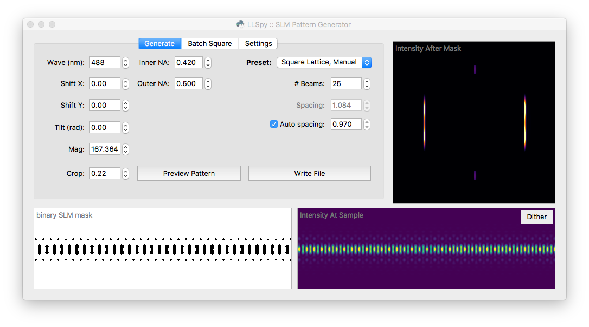

####################################################
llspy-slm: Lattice Light Sheet SLM Pattern Generator
####################################################

|license_shield| |python_shield| |travis_shield|

.. |license_shield| image:: https://img.shields.io/badge/License-BSD%203--Clause-brightgreen.svg
   :target: https://opensource.org/licenses/BSD-3-Clause

.. |python_shield| image:: https://img.shields.io/badge/Python-2.7%2C%203.5%2C%203.6-brightgreen.svg

.. |travis_shield| image:: https://img.shields.io/travis/tlambert03/llspy-slm/master.svg
   :target: https://travis-ci.org/tlambert03/llspy-slm

|

.. image:: http://cbmf.hms.harvard.edu/wp-content/uploads/2015/07/logo-horizontal-small.png
    :target: http://cbmf.hms.harvard.edu/lattice-light-sheet/

.. |copy|   unicode:: U+000A9

Copyright |copy| 2017 Talley Lambert, Harvard Medical School.

|

**llspy-slm** is a simple python app for generating binary masks to drive the spatial light modulator (SLM) on Lattice Light Sheet microscopes. It can generate both *square lattices* and *hex lattices*, and includes the ability to automatically set various parameters such as wavelength dependent beam-spacing (fully manually control is also available).  Additionally, there is a batch square lattice feature that can be used to generate a large number of parameter permutations easily.

See complete usage notes in the `documentation <http://llspy-slm.readthedocs.io/>`_.

Requirements
============

* Compatible with Windows (tested on 7/10), Mac or Linux (tested on Ubuntu 16.04)
* Python 3.6 (recommended), 3.5, or 2.7

Installation
============

#. Install `Anaconda <https://www.anaconda.com/download/>`_
#. Launch a ``terminal`` window (OS X, Linux), or ``Anaconda Prompt`` (Windows)
#. Install llspy-slm:

    .. code:: bash

        > conda create -n slmenv
        # for conda ≥ 4.4.0
        > conda activate slmenv
        # for conda < 4.4.0
        > activate slmenv  
        # or on OS X / Linux
        > source activate slmenv

        > conda install -c talley -c conda-forge llspy-slm

    The ``create -n slmenv`` line creates a virtual environment.  This is optional, but recommended as it easier to uninstall cleanly and prevents conflicts with any other python environments.  If installing into a virtual environment, you must source the environment before proceeding, and each time before using llspy-slm.

#. The gui can be launched with ``slmgen``.  You can create a bash script or batch file to autoload the environment and launch the program if desired.

    .. code:: bash

        # Launch Anaconda Prompt and type...
        # for conda ≥ 4.4.0
        > conda activate slmenv
        # for conda < 4.4.0
        > activate slmenv  
        # or on OS X / Linux
        > source activate slmenv

        # launch the gui
        > slmgen

See complete usage notes in the `documentation <http://llspy.readthedocs.io/en/latest/slm.html>`_.

Bug Reports, Feature requests, etc...
=====================================

Pull requests are welcome!

To report a bug or request a feature, please `submit an issue on github <https://github.com/tlambert03/llspy-slm/issues>`_
